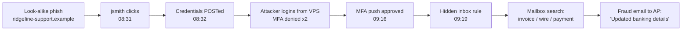

# Phishing Investigation Lab


A hands-on SOC lab for triaging and investigating phishing emails, from raw header analysis through account-compromise scoping, threat-intel enrichment, and incident reporting mapped to MITRE ATT&CK.

The lab simulates a fictional company, **Ridgeline Logistics**. Over one week its SOC receives four user-reported emails, and one of them becomes a **full account takeover with an attempted payment fraud**.

## Results at a Glance

| Case | Type | Verdict | Severity | Report |
|---|---|---|---|---|
| 01 | Credential harvest → account takeover → internal BEC | Malicious, **confirmed compromise** | Critical | [case01_report.md](reports/case01_report.md) |
| 02 | HTML "invoice" attachment (vendor spoofing) | Malicious | Medium | [case02_report.md](reports/case02_report.md) |
| 03 | CEO gift-card BEC (**passes SPF/DKIM/DMARC**) | Malicious | High | [case03_report.md](reports/case03_report.md) |
| 04 | HR open-enrollment notice | Benign (false positive) | Info | [case04_report.md](reports/case04_report.md) |

## Case 01 Attack Chain



**48 seconds** from click to credential theft, **43 minutes** to account takeover, **11 minutes** from takeover to the fraud attempt. Detected by correlating email headers, proxy logs, sign-in logs, and mailbox audit logs into one timeline.

## Skills Demonstrated

- **Email header analysis:** SPF/DKIM/DMARC, `Received` hop tracing, HELO/rDNS mismatch, From / Reply-To / Return-Path mismatches
- **IOC extraction:** URLs, domains, IPs, attachment hashes (SHA-256/MD5), defanged for safe sharing
- **Threat detection logic:** homoglyph/look-alike domains, brand abuse in URLs, executive display-name impersonation, free-mail senders, link text vs. destination mismatch
- **Scoping & compromise detection:** who clicked vs. who submitted (proxy), MFA fatigue (sign-in), inbox-rule persistence and internal phishing (mailbox audit)
- **Incident response:** severity matrix, containment, escalation, lessons learned
- **Reporting:** structured incident reports mapped to **MITRE ATT&CK**
- **Engineering:** Python tooling (standard library only), unit tests, GitHub Actions CI

## Tools

| Tool | What it does |
|---|---|
| [`tools/eml_analyzer.py`](tools/eml_analyzer.py) | Parses `.eml` files: headers, auth results, hop chain, URLs, attachments + hashes, weighted red-flag scoring → text / Markdown / JSON |
| [`tools/build_timeline.py`](tools/build_timeline.py) | Merges email delivery + proxy / sign-in / audit CSVs into one chronological incident timeline |
| [`tools/generate_samples.py`](tools/generate_samples.py) | Rebuilds the simulated dataset |

### Detection improvement (Case 03)

The first version of the analyzer scored the CEO gift-card scam **1 / LOW RISK**: it passed all email authentication and had no links or attachments. I added executive-impersonation and free-mail detection, which re-scored it **5 / LIKELY MALICIOUS**, and added a regression test so it stays caught. Lesson: **SPF/DKIM/DMARC authenticate domains, not people.**

## Quick Start

```bash
git clone https://github.com/Theyloveyoni/Phishing-investigation-lab.git
cd Phishing-investigation-lab


# Triage an email
python3 tools/eml_analyzer.py samples/case01_credential_harvest.eml

# Markdown IOC table / JSON for all cases
python3 tools/eml_analyzer.py samples/case02_invoice_attachment.eml --md
python3 tools/eml_analyzer.py samples/*.eml --json

# Build the Case 01 incident timeline, filtered to the attacker's activity
python3 tools/build_timeline.py --email samples/case01_credential_harvest.eml \
    --logs samples/case01_*.csv --filter jsmith 203.0.113.200 ridgeline-sso-verify

# Run tests
python3 -m unittest discover -s tests -v
```

Example output (Case 01):

```
Auth        : SPF=fail  DKIM=none  DMARC=fail
Origin IP   : 203.0.113.77
Link mismatches:
  - shows 'https://portal.ridgeline.example/password-reset' -> goes to hxxps://ridgeline-sso-verify[.]example/auth/login?u=jsmith
Red flags:
  [!] (+3) Sender domain 'ridgeiine-support.example' is a look-alike of protected domain 'ridgeline.example'
  [!] (+2) URL domain 'ridgeline-sso-verify.example' uses our brand name but is not ours
  [!] (+2) 1 link(s) where display text != real destination
  ...
TRIAGE: LIKELY MALICIOUS (score 12)
```

## Repository Structure

```
├── samples/        Simulated .eml files + proxy / sign-in / mailbox-audit logs
├── tools/          eml_analyzer.py, build_timeline.py, generate_samples.py
├── tests/          Unit + regression tests (run in CI)
├── reports/        Completed incident reports + generated IOC/timeline artifacts
├── docs/
│   ├── walkthrough.md          Step-by-step lab guide (reproduce the investigation)
│   └── escalation-playbook.md  Triage flow, severity matrix, containment, ATT&CK
└── templates/      Incident report template
```

## Safety & Ethics

All organizations, people, domains, and IPs are fictional. Domains use the reserved `.example` TLD (RFC 2606) and IPs use documentation ranges (RFC 5737), so nothing resolves or routes. Attachments are harmless and contain no active content.

## License

MIT
